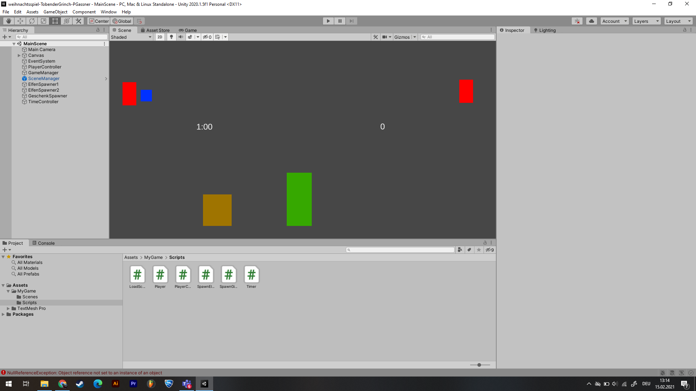
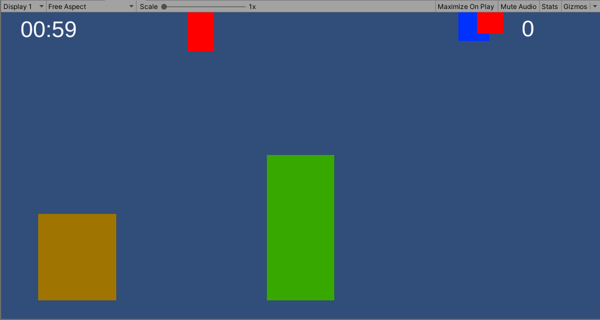

# weihnachtsspiel-TobenderGrinch-PGassner

### Project description: 
Christmas is coming and the Grinch is getting angrier and angrier. He hates Christmas and so he tries to sabotage Santa Claus´ crashed sledge. All the presents are falling down from the sky and the Grinch wants to catch them all. But there are also hard objects pattering down. Everytime the Grinch gets hit by a "bad object" he loses 1 present.

### Development platform: 
(Windows, Unity Version 2020.15.f1, Visual Studio 2019, used SDKs)

### Target platform: 
WebGL, Ref,Res 960x600, screen independent, VR Device incl. reference resolution 

### Visuals: 

    
    

### Necessary setup/execution steps: 
Installation process, e.g. step by step instructions that I can run the project after cloning it

### Third party material: 
(if used Fonts, Sounds, Music, Graphics, Materials, Code etc.)

### Project state: 
coding, no graphics, no animations

### Limitations: 

### Lessons Learned: 

Copyright by PGassner
